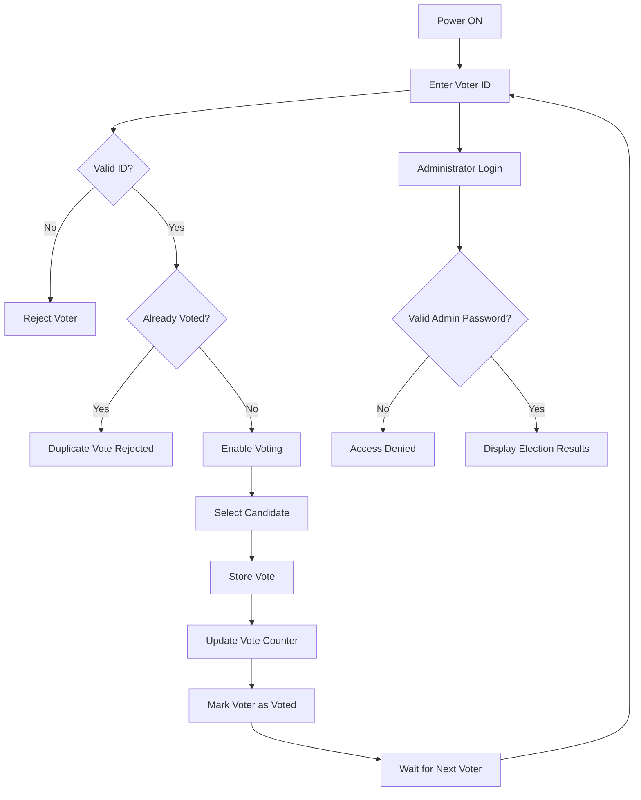
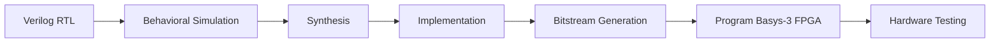

# 🗳️ FPGA-Based Secure Electronic Voting Machine using Verilog HDL

A secure and modular **Electronic Voting Machine (EVM)** designed using **Verilog HDL** and implemented on the **Basys-3 FPGA (Artix-7)**. The system authenticates voters using unique voter IDs, prevents duplicate voting, securely stores votes for multiple candidates, and restricts election results through administrator authentication.

The project follows a modular RTL design approach, where each functional block—including voter authentication, vote storage, administrator control, and result generation—is developed independently and integrated into a complete FPGA-based voting system. The design has been verified through simulation in **Xilinx Vivado**, ensuring reliable and secure operation.

---

## 📌 Project Highlights

- 🔐 Secure voter authentication using unique voter IDs
- 🚫 Prevents duplicate voting attempts
- 🗳️ Supports voting for four different candidates
- 👨‍💼 Administrator authentication for secure result access
- 📊 Automatic vote counting and winner determination
- ⚙️ Modular RTL architecture for easy debugging and scalability
- 🔄 FSM-based control for reliable system operation
- 🧪 Functional verification using Vivado Simulator
- 💡 Designed for FPGA implementation on the Basys-3 board
- 🚀 Future-ready architecture with support for biometric and touch-based authentication

---

## 🛠️ Technologies Used

| Category | Technology |
|----------|------------|
| Hardware Description Language | Verilog HDL |
| FPGA Board | Basys-3 (Xilinx Artix-7) |
| Design Tool | Xilinx Vivado |
| Simulation | Vivado Simulator |
| Digital Design | Finite State Machine (FSM), RTL Design |
| Hardware Components | Push Buttons, LEDs, Seven-Segment Display |
| Future Hardware | TTP223 Capacitive Touch Sensor |

---

## 📂 Repository Structure

```text
FPGA-Secure-EVM/
│
├── rtl/
│   ├── voter_input_interface.v
│   ├── authentication_module.v
│   ├── vote_input_interface.v
│   ├── vote_storage.v
│   ├── admin_authentication.v
│   ├── result_generation.v
│   ├── fsm_controller.v
│   └── top_module.v
│
├── testbench/
│   └── top_module_tb.v
│
├── constraints/
│   └── basys3.xdc
│
├── simulation/
│   ├── waveforms/
│   └── screenshots/
│
├── docs/
│   ├── System_Architecture.png
│   ├── RTL_Schematic.png
│   ├── FSM_Diagram.png
│   └── Project_Report.pdf
│
├── images/
│
└── README.md
```

---

# 🏗️ System Architecture

The Electronic Voting Machine is built using a modular architecture where each module performs a dedicated task. The voter first enters a valid voter ID, which is verified by the authentication module. After successful authentication, the voter selects a candidate, and the vote is securely stored. Duplicate voting is prevented by maintaining the voting status of each authorized voter. Election results remain protected until the administrator successfully logs in.


---

## 🔄 High-Level Workflow

```text
            Voter
              │
              ▼
      Enter Voter ID
              │
              ▼
     Authentication Module
              │
      ┌───────┴────────┐
      │                │
 Invalid ID       Valid ID
      │                │
      ▼                ▼
   Reject        Already Voted?
                      │
             ┌────────┴────────┐
             │                 │
           Yes                No
             │                 │
             ▼                 ▼
          Reject        Select Candidate
                              │
                              ▼
                       Store Vote Securely
                              │
                              ▼
                     Administrator Login
                              │
                              ▼
                    Display Election Results
```

---
# 🎯 Project Motivation

Traditional electronic voting systems often face challenges related to security, vote integrity, and unauthorized access. The primary objective of this project was to design a secure FPGA-based Electronic Voting Machine that ensures only authorized voters can cast a vote while preventing duplicate voting attempts.

Instead of building a monolithic design, the system follows a **modular RTL architecture**, where each functional block performs a specific task. This approach improves readability, simplifies debugging, and allows future enhancements without affecting the overall system.

The project also provides practical experience in designing finite state machines (FSMs), implementing digital authentication logic, integrating multiple RTL modules, and validating the complete system using simulation.

---

# 💡 Working Principle

The Electronic Voting Machine operates in a sequence of well-defined steps to ensure secure and reliable voting.

1. The voter enters a unique voter ID.
2. The authentication module verifies whether the voter ID is valid.
3. The system checks whether the voter has already cast a vote.
4. If the voter is eligible, the voting interface is enabled.
5. The voter selects one of the available candidates.
6. The selected candidate's vote count is updated.
7. The voter is marked as "Voted" to prevent duplicate voting.
8. Election results remain hidden until the administrator successfully authenticates.
9. After successful administrator login, the final vote count and winning candidate are displayed.

This sequence ensures that every eligible voter can vote exactly once while maintaining the confidentiality of election results.

---

# 🔐 Voter Authentication

Authentication is the first security layer of the system.

Every voter is assigned a unique voter ID stored within the authentication module. When a voter enters an ID, the module compares it with the list of registered IDs.

- If the ID is valid, the voter is allowed to proceed.
- If the ID is invalid, the request is rejected.
- If the voter has already voted, the system immediately blocks the voting attempt.

This mechanism prevents unauthorized access and duplicate voting without requiring external memory or databases.

---

# 🔄 System Workflow



---

# 🧩 RTL Modules

The design is divided into several independent RTL modules. Each module performs a dedicated task, making the overall system modular, reusable, and easier to verify.

---

## 1️⃣ Voter Input Interface

The voter input interface receives the voter ID entered by the user and forwards it to the authentication module.

**Responsibilities**

- Accept voter ID
- Validate input timing
- Forward data for authentication

---

## 2️⃣ Authentication Module

This module verifies whether the entered voter ID belongs to an authorized voter.

It also maintains the voting status of every registered voter.

**Responsibilities**

- Verify voter ID
- Detect invalid users
- Detect duplicate voting
- Generate authentication status

---

## 3️⃣ Vote Input Interface

Once authentication is successful, this module enables the voting interface.

The voter can select one candidate using the available input buttons.

**Responsibilities**

- Enable voting after authentication
- Read candidate selection
- Prevent invalid inputs

---

## 4️⃣ Vote Storage Module

This module is responsible for securely storing votes.

Each candidate has an independent vote counter.

Whenever a valid vote is received, only the corresponding candidate counter is incremented.

**Responsibilities**

- Store votes
- Maintain vote count
- Prevent incorrect updates

---

## 5️⃣ Administrator Authentication

Election results should not be visible to voters.

This module verifies the administrator password before enabling result mode.

**Responsibilities**

- Verify administrator credentials
- Enable result display
- Restrict unauthorized access

---

## 6️⃣ Result Generation Module

Once administrator authentication is successful, this module displays

- Total votes received by each candidate
- Winning candidate
- Election results

---

## 7️⃣ FSM Controller

The Finite State Machine (FSM) acts as the central controller of the entire voting system.

Instead of allowing modules to operate independently, the FSM coordinates every operation in the correct order.

Typical states include

- Idle
- Authentication
- Voting
- Vote Storage
- Admin Authentication
- Result Display

This state-based design ensures reliable system behavior and prevents invalid transitions between different stages of the voting process.

---

# ⚙ Why FSM?

A Finite State Machine provides a structured method for controlling sequential digital systems.

Using an FSM offers several advantages:

- Predictable system behavior
- Easy debugging
- Controlled state transitions
- Simplified verification
- Improved scalability

Since voting follows a fixed sequence of operations, an FSM is an ideal choice for implementing the control logic of the Electronic Voting Machine.

---

# 🏗 RTL Architecture

The complete design follows a hierarchical RTL architecture where each module communicates through well-defined control signals.

```text
                 Voter

                   │

                   ▼

        Voter Input Interface

                   │

                   ▼

      Authentication Module

                   │

         Authentication OK

                   ▼

        Vote Input Interface

                   │

                   ▼

         Vote Storage Module

                   │

                   ▼

          FSM Controller

                   │

                   ▼

      Administrator Login

                   │

                   ▼

       Result Generation
```


# 🔒 Security Features

The Electronic Voting Machine incorporates multiple security mechanisms to improve reliability.

- Unique voter identification
- Duplicate vote prevention
- Administrator authentication
- Controlled result access
- Modular verification
- FSM-based operation
- Secure vote storage

These mechanisms ensure that the voting process remains accurate, reliable, and resistant to unauthorized access.

# 🧪 Functional Verification

The complete Electronic Voting Machine was verified using **Xilinx Vivado Simulator** before hardware implementation. Individual RTL modules were first tested independently and later integrated into the complete system.

The verification process included validating voter authentication, candidate selection, vote storage, administrator authentication, and result generation under different test scenarios.

The following functionality was verified during simulation:

- ✔ Valid voter authentication
- ✔ Invalid voter rejection
- ✔ Duplicate vote prevention
- ✔ Correct vote counting
- ✔ Administrator authentication
- ✔ Secure result display
- ✔ Proper FSM state transitions

This modular verification approach helped identify design issues early and ensured correct system behavior after integration.

---

# 🖥 FPGA Implementation

After successful simulation, the RTL design was synthesized and implemented on the **Basys-3 FPGA Development Board**, which is based on the **Xilinx Artix-7 FPGA**.

The FPGA implementation demonstrates that the design can operate on real hardware with dedicated input buttons and output indicators.

### Hardware Used

| Component | Purpose |
|-----------|----------|
| Basys-3 FPGA Board | Hardware Platform |
| Push Buttons | Voter Input |
| Slide Switches | Candidate Selection |
| LEDs | Status Indication |
| Seven Segment Display | Display Vote Count / Results |

---

# ⚙ FPGA Workflow



---


# 🚀 Future Improvements

Although the current implementation successfully demonstrates a secure FPGA-based voting machine, several enhancements can further improve the system.

Some possible future improvements include:

- Biometric authentication using fingerprint sensors
- RFID-based voter identification
- Aadhaar or Smart Card authentication
- Touchscreen voting interface
- Secure encrypted vote storage
- Wireless result transmission
- Cloud-based election monitoring
- Real-time voter database integration
- LCD or OLED display support
- Support for a larger number of candidates
- UART or SPI interface for external communication
- FPGA-to-PC communication for result logging

---


# 🤝 Contributing

Contributions, suggestions, and improvements are always welcome.

If you find any issue or have ideas for improving the project, feel free to open an Issue or submit a Pull Request.

---


# 👨‍💻 Author

## Hartik Rai

**B.Tech in Electronics and Communication Engineering**

National Institute of Technology Jalandhar


## ⭐ If you found this project helpful, please consider giving it a Star!
