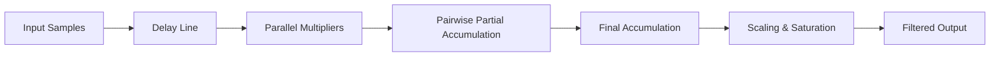
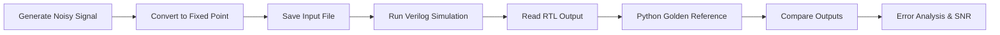
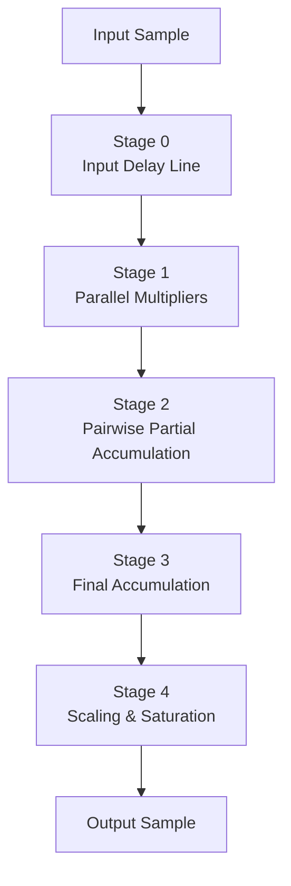
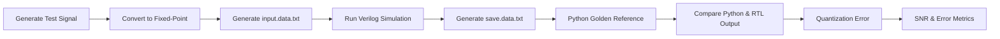

# 🚀 Parameterized Pipelined Fixed-Point Moving Average FIR Filter

> A parameterized **8-Tap Fixed-Point Moving Average FIR Filter** implemented in **Verilog HDL** using a **4-stage pipelined architecture**. The design is functionally verified against a **Python golden reference model** through automated waveform comparison, quantization error analysis, and Signal-to-Noise Ratio (SNR) evaluation.

---

## 📖 Overview

Finite Impulse Response (FIR) filters are fundamental building blocks in Digital Signal Processing (DSP) systems and are widely used in communication systems, biomedical signal processing, audio enhancement, and embedded applications.

This project presents a **parameterized hardware implementation** of an **8-Tap Moving Average FIR Filter** using **fixed-point arithmetic** to reduce hardware complexity while maintaining computational accuracy. To improve throughput and reduce the critical path, the filter is implemented using a **4-stage pipelined architecture** consisting of parallel multiplication, pairwise accumulation, final accumulation, and output scaling with saturation logic.

To verify the RTL implementation, an independent **Python golden reference model** was developed. The Python model generates noisy input signals, converts them into fixed-point representation, executes the reference FIR algorithm, reads the RTL simulation output, compares both implementations, and evaluates the design using **quantization error** and **Signal-to-Noise Ratio (SNR)** analysis.

The project demonstrates practical RTL design techniques, fixed-point DSP implementation, pipelining, and hardware verification methodologies commonly used in FPGA and ASIC design.

---

## ✨ Features

* ✔ Parameterized FIR filter architecture
* ✔ 8-Tap Moving Average (Low-Pass) Filter
* ✔ Signed Fixed-Point Arithmetic
* ✔ Four-stage pipelined architecture
* ✔ Parallel multiplication for improved throughput
* ✔ Pairwise adder-tree accumulation
* ✔ Saturation arithmetic for overflow protection
* ✔ External coefficient loading using `$readmemb`
* ✔ Python golden reference model
* ✔ Automated RTL verification flow
* ✔ Quantization error analysis
* ✔ Signal-to-Noise Ratio (SNR) evaluation
* ✔ Modular and reusable Verilog implementation

---

# 🛠 Technologies Used

| Category                      | Tool / Language           |
| ----------------------------- | ------------------------- |
| Hardware Description Language | Verilog HDL               |
| Simulation                    | Xilinx Vivado Simulator   |
| Verification                  | Python                    |
| Numerical Computing           | NumPy                     |
| Visualization                 | Matplotlib                |
| DSP Technique                 | Fixed-Point FIR Filtering |

---

# ⚙ Design Parameters

| Parameter           | Description                |       Value |
| ------------------- | -------------------------- | ----------: |
| **TAPS**            | Number of FIR coefficients |       **8** |
| **N1**              | Coefficient width          |  **8 bits** |
| **N2**              | Input sample width         | **16 bits** |
| **N3**              | Output width               | **32 bits** |
| **Pipeline Stages** | Total pipeline depth       |       **4** |

---

# 🏗 High-Level Architecture



---

# 🔄 Verification Flow




# 📚 Theory of Moving Average FIR Filter

A **Finite Impulse Response (FIR) filter** is a digital filter whose output depends only on the current and previous input samples. Unlike IIR filters, FIR filters do not use feedback, making them inherently stable and suitable for hardware implementation.

The Moving Average Filter is one of the simplest FIR filters. It reduces random noise by averaging a fixed number of recent input samples, thereby acting as a **low-pass filter**.


Since all coefficients are identical,

```text
h[0] = h[1] = ... = h[7] = 1/8
```

every input sample contributes equally to the output.

---

# 🎯 Why a Moving Average Filter?

The moving average filter was selected because it provides an excellent platform for demonstrating several important hardware design concepts without introducing unnecessary mathematical complexity.

Some of its advantages include:

* Simple coefficient generation
* Linear phase response
* Inherent stability
* Efficient hardware implementation
* Good noise suppression capability
* Easy verification against a software reference model

Although the filter itself is mathematically simple, implementing it efficiently in hardware requires careful consideration of arithmetic precision, pipelining, and timing.

---

# 🔢 Fixed-Point Representation

Hardware implementations generally avoid floating-point arithmetic because floating-point multipliers and adders require significantly more logic resources and consume higher power.

Instead, this project uses **signed fixed-point arithmetic**, which provides a good balance between numerical accuracy and hardware efficiency.

The coefficient width is

```text
N1 = 8 bits
```

The input sample width is

```text
N2 = 16 bits
```

The output width is

```text
N3 = 32 bits
```

To represent fractional coefficients, each coefficient is multiplied by a scaling factor

```text
Scaling Factor = 2^(N1-1)
```

For

```text
N1 = 8
```

the scaling factor becomes

```text
128
```

Therefore,

```text
1/8 × 128 = 16
```

which is stored as

```text
00010000
```

During the final pipeline stage, the accumulated result is restored to its original magnitude by performing an arithmetic right shift.

```verilog
output_data <= final_acc >>> (N1-1);
```

This approach eliminates floating-point hardware while maintaining sufficient numerical precision for the filter.

---

# 🏗 RTL Architecture

The filter architecture is divided into five logical stages to improve throughput and reduce the critical path.



Each stage performs an independent task and passes its result to the next pipeline stage on every clock cycle.

After the pipeline is filled, one filtered output is produced every clock cycle.

---

# ⚙ Pipeline Stage 0 – Input Delay Line

The first stage stores previous input samples using a shift register.

```text
Current Input

↓

x[n]

↓

x[n-1]

↓

x[n-2]

↓

...

↓

x[n-7]
```

Every new clock cycle shifts the stored samples by one position.

This delay line ensures that every filter coefficient is multiplied with the correct delayed input sample.

---

# ✖ Pipeline Stage 1 – Parallel Multiplication

Once the delayed samples are available, every sample is multiplied with its corresponding coefficient **simultaneously**.

```text
coeff[0] × x[n]

coeff[1] × x[n-1]

coeff[2] × x[n-2]

...

coeff[7] × x[n-7]
```

Instead of using a single multiplier repeatedly, all multiplications are performed in parallel, significantly improving throughput.

The multiplication results are stored in pipeline registers for the next stage.

---

# ➕ Pipeline Stage 2 – Pairwise Partial Accumulation

Summing all eight multiplication results in a single combinational block would increase the propagation delay.

To reduce the critical path, the products are first added in pairs.

```text
P0 = M0 + M1

P1 = M2 + M3

P2 = M4 + M5

P3 = M6 + M7
```

This pairwise accumulation decreases the number of operands entering the final adder stage and improves timing performance.

---

# ➕ Pipeline Stage 3 – Final Accumulation

The partial sums generated in the previous stage are accumulated to obtain the complete convolution result.

```text
Final Sum

=

P0 + P1 + P2 + P3
```

The accumulated value is stored in a register before proceeding to the final output stage.

Registering the accumulated result separates long combinational paths and enables higher operating frequencies.

---

# 📏 Pipeline Stage 4 – Scaling and Saturation

Since the coefficients were scaled before multiplication, the accumulated result must be scaled back.

This is achieved using an arithmetic right shift.

```verilog
scaled_output = final_acc >>> (N1-1);
```

To prevent arithmetic overflow, saturation logic limits the output within the representable range.

```text
If Output > MAX

↓

Output = MAX

If Output < MIN

↓

Output = MIN
```

Unlike wrap-around arithmetic, saturation preserves signal integrity and avoids unexpected output values when overflow occurs.

---

# ⏱ Pipeline Latency

Because the design is fully pipelined, the first valid output is not produced immediately.

The total latency is

```text
Latency = (TAPS − 1) + Pipeline Stages
```

For this implementation,

```text
Latency = (8 − 1) + 4

Latency = 11 Clock Cycles
```

After these initial cycles, the pipeline is completely filled and produces **one output sample every clock cycle**, resulting in a throughput of **one sample per clock**.

---

# 💡 Design Decisions

Several architectural decisions were made to improve performance and maintain modularity.

### Parameterized Design

The filter is fully parameterized using

```verilog
TAPS
N1
N2
N3
```

allowing the same RTL to be reused for different filter lengths and bit widths.

---

### Parallel Processing

All multiplications are performed simultaneously instead of sequentially.

This increases hardware utilization but significantly improves throughput.

---

### Pairwise Accumulation

Instead of adding all products together in one long adder chain, partial sums are generated first.

This reduces combinational delay and shortens the critical path.

---

### Fixed-Point Arithmetic

Fixed-point arithmetic was selected because it offers lower hardware complexity compared to floating-point implementations while maintaining sufficient precision for DSP applications.

---

### Saturation Arithmetic

Overflow is handled using saturation instead of wrap-around arithmetic.

This prevents incorrect output values caused by arithmetic overflow and improves numerical stability.

---


# ✅ Verification Methodology

To ensure the correctness of the RTL implementation, an independent **Python golden reference model** was developed. Instead of relying only on waveform inspection, the Verilog output is automatically compared against the Python reference implementation for every output sample.

The verification process consists of four major stages:

1. Test signal generation
2. Fixed-point conversion
3. RTL simulation
4. Output comparison and error analysis

This methodology provides a systematic way to verify both the functionality and numerical accuracy of the hardware design.

---

# 🔄 Verification Flow



---

# 🎵 Test Signal Generation

The verification process begins by generating a noisy input signal in Python.

```python
input = sin(2t) + cos(3t) + noise
```

where

* `sin(2t)` represents a low-frequency sinusoidal component.
* `cos(3t)` represents another frequency component.
* Random Gaussian noise is added to simulate real-world noisy signals.

This input is intentionally chosen to evaluate the smoothing capability of the moving average filter.

---

# 🔢 Fixed-Point Conversion

The generated floating-point samples cannot be directly processed by the Verilog implementation.

Therefore, every sample is converted into signed fixed-point representation using the scaling factor

```text
2^(N1-1)
```

Each scaled value is stored as a **16-bit signed binary number**.

Example:

```text
Floating Point

↓

Scaling

↓

Signed Integer

↓

Binary Representation

↓

input.data.txt
```

The generated `input.data.txt` file serves as the stimulus for the Verilog testbench.

---

# ⚙ RTL Simulation

The Verilog testbench performs the following operations:

* Reads the fixed-point input samples from `input.data.txt`
* Applies one sample every clock cycle
* Waits until the pipeline latency is completed
* Captures valid output samples
* Stores the filtered output into `save.data.txt`

Since the architecture is pipelined, the first valid output appears only after the pipeline has been completely filled.

The latency is calculated as

```text
Latency = (TAPS − 1) + Pipeline Stages

Latency = 11 Clock Cycles
```

The testbench automatically ignores invalid startup samples before writing the final output file.

---

# 🐍 Python Golden Reference

The Python verification model performs the same filtering operation independently of the RTL implementation.

The model performs the following tasks:

* Reads the filter coefficients
* Performs Moving Average FIR filtering
* Uses identical fixed-point scaling
* Produces the expected output
* Reads RTL simulation output
* Aligns both signals after pipeline latency
* Compares every output sample

Because the Python implementation is completely independent from the Verilog code, it acts as a reliable **golden reference model**.

---

# 📊 Output Comparison

After simulation, the RTL output is compared with the Python reference output.

The comparison verifies that

* Every output sample matches the expected value.
* Pipeline latency is correctly handled.
* Fixed-point arithmetic is implemented correctly.
* Scaling and saturation logic operate as intended.

---

# 📊 Performance Metrics

The Python verification script evaluates several numerical performance metrics.

* Signal Power
* Error Power
* Signal-to-Noise Ratio (SNR)
* Maximum Absolute Error
* Mean Absolute Error
* Mean Relative Error

These metrics provide quantitative evidence that the RTL implementation closely matches the reference software model.

> **Note:** The exact numerical values depend on the randomly generated input signal used during each verification run.

---

# ▶ How to Run the Project

## Step 1

Clone the repository.

```bash
git clone https://github.com/your-username/FIR_Filter.git
```

---

## Step 2

Generate the fixed-point input samples using Python.

```bash
python verification.py
```

This creates

```text
input.data.txt
```

---

## Step 3

Open the Vivado project.

Run Behavioral Simulation.

The testbench automatically reads

```text
input.data.txt
```

and generates

```text
save.data.txt
```

---

## Step 4

Run the Python verification script again.

The script

* Reads `save.data.txt`
* Generates comparison plots
* Computes error metrics
* Calculates SNR

---

# 🚀 Future Improvements

The current implementation focuses on functional verification using RTL simulation.

Several enhancements can be incorporated in future versions of this project:

* FPGA implementation and hardware validation
* Runtime coefficient loading
* Support for arbitrary FIR coefficients
* AXI4-Stream interface
* DSP48-based multiplier implementation
* Automatic coefficient generation using MATLAB/Python
* Support for higher-order FIR filters
* Recursive adder-tree architecture for large tap counts
* SystemVerilog assertions for automated verification
* UVM-based verification environment

---


# 👨‍💻 Author

**Hartik Rai**

B.Tech in Electronics and Communication Engineering

National Institute of Technology Jalandhar

If you found this project helpful or interesting, feel free to ⭐ the repository.
